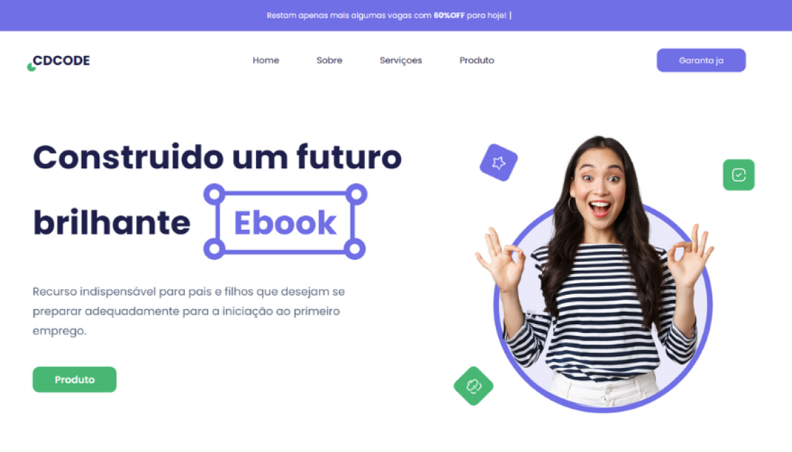

<h1 align="center">
  ✍ Construindo um futuro brilhante
</h1>

<h4 align="center"><a href="https://pagina-de-vendas-ebook-carlosdanyel.vercel.app/">Clique para visitar o projeto</a></h4>

## 📚 Seções

O site é composto por seis seções:

- **Home:** Nele temos uma breve apresentação;
- **Vantagens** Exibe as vantagens do nosso produto;
- **Provas reais** Nele apresentamos os fedbacks dos nossos clientes;
- **sobre:** Uma breve descrição do produto;
- **Perguntas:** Perguntas diarias dos nosso clientes;
- **Compra:** A nossa oferta;

---

## 💼 Tecnologias utilizadas

Para o desenvolvimento deste site utilizei as seguintes tecnologias:

- React;
- Sass/Scss;
- React-scroll;  
- Typed.js;
---

<h2>Desenvolvedor</h2>

<table>
  <tr>
    <td align="center">
      
Carlos Danyel Silva Teixeira

    </td>
  </tr>
</table>
